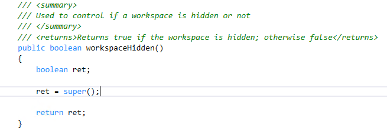

---
# required metadata

title: Help secure mobile workspaces
description: This topic describes how to limit a user's access to a workspace.
author: makhabaz
manager: AnnBe
ms.date: 11/10/2017
ms.topic: article
ms.prod: 
ms.service: dynamics-ax-platform
ms.technology: 

# optional metadata

# ms.search.form: 
# ROBOTS: 
audience: Developer, IT Pro
# ms.devlang: 
ms.reviewer: sericks
ms.search.scope: Operations
# ms.tgt_pltfrm: 
ms.custom: 255544
ms.assetid: 
ms.search.region: Global
# ms.search.industry: 
ms.author: makhabaz
ms.search.validFrom: 2017-07-20
ms.dyn365.ops.version: Platform update 3

---

# Help secure mobile workspaces

[!include [banner](../../../includes/banner.md)]

This topic describes how to limit a user's access to a workspace.

## Assign a menu item to workspace
Workspaces can be tied to a menu item. Users who don't have access to the menu item can't use the workspace, because the workspace is shown only to users who have rights to the menu item.

If a menu item isn't assigned to a workspace, the workspace is always shown to the user.

Follow these steps to help secure your workspaces by assigning a menu item.

1. Add a **SysAppWorkspaceSecurityAttribute** attribute to the workspace class, and specify the menu item to assign to the workspace.

    

2. Build the menu item and workspace. To test your changes, sign in to mobile app by using a user account that does’nt have access to the menu item.

## Override the workspaceHidden method
You can also specify whether the workspace is hidden or shown, based on parameters. By overriding the **workspaceHidden** method, you enable your code to control the visibility of the workspace, as shown in the following code example.

## Add a menu item and override the workspaceHidden method
You can use both the preceding methods in your app. The menu item provides a security check, and the **workspaceHidden** method contains additional logic that is related to the visibility of the workspace.
