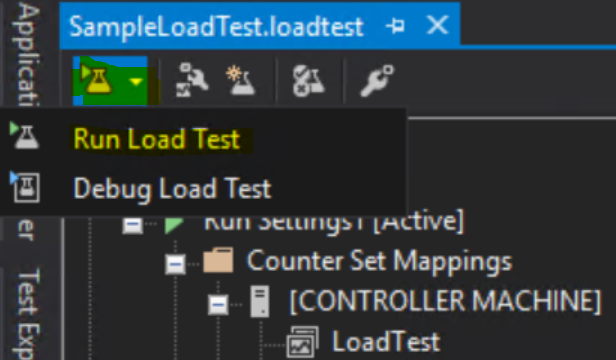

---
# required metadata

title: Multi-user testing with the Performance SDK and Azure DevOps
description: This topic explains how to do multi-user testing by using the Performance SDK and Microsoft Azure DevOps together with performance test scripts that are generated by using Task recorder. 
author: hasaid
manager: AnnBe
ms.date: 06/04/2019
ms.topic: article
ms.prod: 
ms.service: dynamics-ax-platform
ms.technology: 

# optional metadata

# ms.search.form: 
# ROBOTS: 
audience: Developer
# ms.devlang: 
ms.reviewer: rhaertle
ms.search.scope: Operations
# ms.tgt_pltfrm: 
ms.custom: 9954
ms.assetid: 7b605810-e4da-4eb8-9a26-5389f99befcf
ms.search.region: Global
# ms.search.industry: 
ms.author: jujoh
ms.search.validFrom: 2016-02-28
ms.dyn365.ops.version: AX 7.0.0

---

# Multi-user testing with the Performance SDK and Azure DevOps

[!include [banner](../includes/banner.md)]

  > [!IMPORTANT]
  > Visual Studio 2019 will be the last version of Visual Studio with web performance and load test features. In the future, we will publish some recommendations for alternative solutions.  
  > - If you are using the Visual Studio and Test Controller/Test Agent for on-premises load testing, Visual Studio 2019 will be the last version. You can continue using it until the end of the support cycle. 
  > - If you are using the cloud-based load testing service, it will continue to run through March 31, 2020. Until then, you can continue to use all of the experiences powered by this service without interruption. Alternatively, you can switch to on-premises load testing. For more information, see [Cloud-based load testing service end of life](https://devblogs.microsoft.com/devops/cloud-based-load-testing-service-eol/).

## Prerequisites

Before you can complete the steps in this topic, verify that the following prerequisites are met:

- You have a development environment that has platform update 21 or later in own your Microsoft Azure subscription
- You have Microsoft Visual Studio 2015 Enterprise edition in a development environment.
- You have a tier-2 or above sandbox that has the same release (application version and platform update) as your development environment.
- You've completed all the steps in [Single-user testing with Task recorder and the Performance SDK](single-user-test-perf-sdk.md) and all the steps except "Run multi-user testing with local test controller" in [Multi-user testing with the Performance SDK and a local test controller](multi-user-testing-local-test-controller.md).

## Prepare the PerfSDKSample solution for multi-user testing

1. Connect Microsoft Visual Studio in a development environment to an Azure DevOps project.

    

    > [!NOTE]
    > When you add the Azure DevOps server, use **https://\<YourAzureDevOpsAccount\>.visualstudio.com**.

2. On your Azure DevOps project dashboard, select **Open in Visual Studio**, and then select **Allow in prompted window**.

    

3. After Visual Studio is opened, verify that you're running it as an admin. If you aren't, close it, and then reopen it as an admin.
4. Go to K:\PerfSDK\PerfSDKLocalDirectory\SampleProject, and change the file, **vsonline.testsettings**.
5. In the **Test Settings** dialog box, on the **General** tab, select the **Run tests using Visual Studio Team Services** option.
6. On the **Deployment** tab, leave all the fields set as they were set in [Multi-user testing with the Performance SDK and a local test controller](multi-user-testing-local-test-controller.md).

    

7. On the **Setup and Cleanup Scripts** tab, point the **Setup script** field to the **setup.cmd** file under the **Visual Studio Online** folder.

    

8. On the **Additional Settings** tab, leave all the fields set as they were set in [Multi-user testing with the Performance SDK and a local test controller](multi-user-testing-local-test-controller.md).

    

9. Select **Apply and Close**.

## Run multi-user testing by using Azure DevOps

1. In Visual Studio, open **SampleLoadTest.loadtest**.
2. Select **Run Load Test**.

    

    The load test is run, and a chart shows its progress.    
   
   

    

3. Review the test output.

    

    

    

## Tips

To switch multi-user testing between the local test controller and Azure DevOps, create a copy of **testsettings** for each, and then select the copy that you want as **Active Test Settings**.

## Troubleshooting

For information about single-user or multi-user testing that uses the Performance SDK, see [Troubleshooting guide for single-user or multi-user testing with the Performance SDK](troubleshoot-perf-sdk-user-testing.md).
