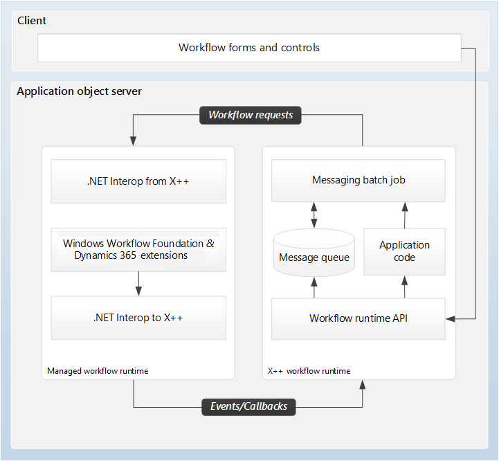

---
# required metadata

title: Workflow system architecture
description: This article describes the architecture of the workflow system.
author: sericks007
manager: AnnBe
ms.date: 08/18/2017
ms.topic: article
ms.prod: 
ms.service: dynamics-ax-applications
ms.technology: 

# optional metadata

# ms.search.form: 
# ROBOTS: 
audience: Developer, IT Pro
# ms.devlang: 
ms.reviewer: sericks
ms.search.scope: Core, Operations
# ms.tgt_pltfrm: 
ms.custom: 56351
ms.assetid: 107a3f9f-aa1d-4087-9b35-196d8b82b0fb
ms.search.region: Global
# ms.search.industry: 
ms.author: tjvass
ms.search.validFrom: 2016-02-28
ms.dyn365.ops.version: AX 7.0.0

---

# Workflow system architecture

[!include [banner](../includes/banner.md)]

This article describes the architecture of the workflow system.

The workflow infrastructure consists of two components that are hosted on Application Object Server (AOS): the X++ workflow runtime and the managed workflow runtime.

The X++ workflow runtime consists of the following components:

- Workflow runtime application programming interface (API)
- A messaging batch job
- A message queue

Either the messaging batch job or the workflow runtime API can invoke the application code, if it's required. The X++ workflow runtime is compiled into the Common Intermediate Language (CIL) of the Microsoft .NET Framework.

The managed workflow runtime consists of the Windows Workflow Foundation and Finance and Operations apps extensions.

Logically, the workflow infrastructure is an extension and is transparent to users. Physically, both the X++ workflow and the managed workflow runtimes are hosted on AOS. The workflow infrastructure uses batch processing on AOS and .NET Interop to integrate both subsystems, and to pass messages from one subsystem to the other. The X++ code that is run in the batch processor is compiled to .NET CIL. The batch processing runs in the .NET common language runtime (CLR).

The following figure shows the high-level architecture of the workflow infrastructure.

Users can use workflow pages and controls to participate in business processes.

Developers can create workflows for the objects that they have added. The following table describes the workflow steps that occur when a user submits an expense report to the workflow system for approval.

| Step | Runtime                  | Activity |
|------|--------------------------|----------|
| 1    | X++ workflow runtime     | A user submits an expense report by clicking the **Submit** button on one of the workflow controls. This action causes X++ code to activate a workflow instance by calling the workflow runtime API. The workflow runtime API posts a message to the message queue. The messaging batch job reads the message and sends a workflow activation request to the managed workflow runtime.<blockquote>[!NOTE] The messaging batch job processes the message queue at one-minute intervals.</blockquote> |
| 2    | Managed workflow runtime | .NET Interop from X++ receives the message and starts a new workflow instance via Windows Workflow Foundation. This workflow instance performs a callback to the X++ workflow runtime API via .NET Interop to X++ CIL and posts a message that the workflow has started.
After the message is posted, the managed workflow runtime saves the idle workflow instance to the database. The runtime then removes the workflow instance from memory. When the managed workflow runtime receives another message from the X++ workflow runtime for this workflow instance, it restores the workflow instance to memory and resumes it.

Each workflow instance is unique. If two users submit their expense reports for approval, two workflow instances are started.
 |
| 3    | X++ workflow runtime     | The messaging batch job reads the **workflow started** message from the message queue and invokes the application event handler to process a **workflow started** event. The batch job then posts an acknowledgment message that the event was processed. |
| 4    | Both                     | This same messaging pattern is repeated, as required, throughout the lifecycle of the workflow instance. |

The workflow architecture helps provide a reliable and durable messaging system, and also helps guarantee that the state of the workflow is always synchronized with the state of the application. If an unexpected hardware or software failure occurs, the workflow instance state is returned to its last known saved point, and the message stays in the queue. Therefore, from an architecture perspective, the recovery model is to fix the problem and resume the workflow.
