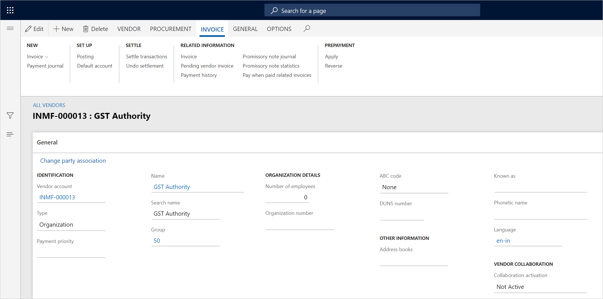
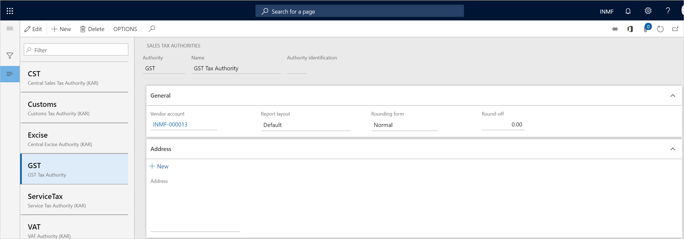
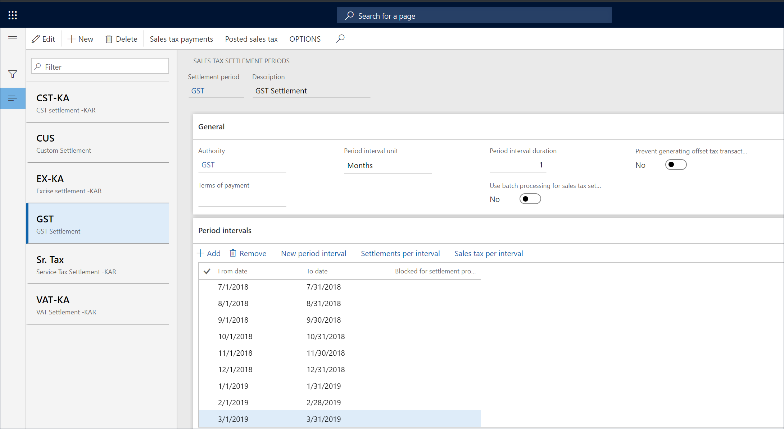

---
# required metadata

title: Create a tax settlement period
description: This topic explains how to create a tax settlement period. This task is part of the master data setup that is required to make the India localization solution for Goods and Services Tax (GST) available.
author: kfend
manager: RichardLuan
ms.date: 06/04/2019
ms.topic: article
ms.prod: 
ms.service: dynamics-365-applications
ms.technology: 

# optional metadata

# ms.search.form: 
audience: Application User
# ms.devlang: 
ms.reviewer: kfend
ms.search.scope: Core, Operations
# ms.tgt_pltfrm: 
# ms.custom: 
ms.search.region: India
# ms.search.industry: 
ms.author: EricWang
ms.search.validFrom: 2019-06-01
ms.dyn365.ops.version: 10.0.4

---

# Create a tax settlement period

[!include [banner](../includes/banner.md)]

To make the India localization solution for Goods and Services Tax (GST) in Microsoft Dynamics 365 Finance available, you must complete the following master data setup:

- Define a business vertical.
- Update the state code and union territory.
- Create a Goods and Services Tax Identification Number (GSTIN) master.
- Define GSTINs for the legal entity, warehouse, vendor, or customer masters.
- Define Harmonized System of Nomenclature (HSN) codes and Service Accounting Codes (SACs).
- Create main accounts for the GST posting type.
- Create a tax settlement period.
- Attach the GSTIN to a tax registration group.

Follow these steps to create a tax settlement period.

1. Go to **Accounts payable** \> **Vendors** \> **All vendors**, and create a vendor GST authority.

    

2. Go to **Tax** \> **Indirect tax** \> **Sales tax** \> **Sales tax authorities**, create a tax authority, and assign the vendor account that you created in the previous step.

    

3. Go to **Tax** \> **Indirect tax** \> **Sales tax** \> **Sales tax settlement periods**, and create a tax period for GST.

    
